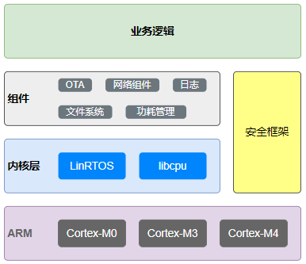
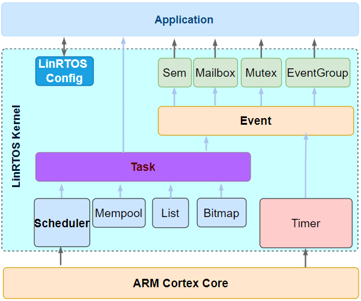

本项目为2021年自己从零到一写出来的简易RTOS系统，目的是为了能更加深入的学习RTOS系统及底层运行的逻辑，项目命名为"LinRTOS",为什么会取这个名字呢？因为我叫Dalin，哈哈哈。

LinRTOS开发基于MDK平台，目前工程工程自动适配Cortex M0/M3/M4

## 参考说明
写该系统主要参考的有两个知名的RTOS框架：为[FreeRTOS](https://freertos.org/RTOS.html)和[RT-Thread](https://www.rt-thread.org/document/site/#/rt-thread-version/rt-thread-standard/README)，FreeRTOS从远源码角度进行学习的，RT-Thread从Api的命名及系统框架结构上进行了一定借鉴。

这里想对国内的RT-Thread做定义说明，都知道老牌FreeRTOS是免费商业使用，其实RT-Thread也是可免费商业使用，只是RT-Thread有扩展的增值服务才需要进行收费：
- github master代码仓上你能看到的都是开源、免费的，可以免费商用

## LinRTOS命名
函数命名规则主要参照FreeRTOS:

### **变量名**

定义变量的时候往往会把变量的类型当作前缀加在变量上，这样的好处是让用户一看到这个变量就知道该变量的类型：
- c :  char 型变量.
- s : short 型变量.
- l : long型变量.
- x : portBASE_TYPE类型变量,数据结构，任务句柄，队列句柄等定义的变量名.
- u : 无符号型的前面.
- p : 指针变量的前面.

例：当我们定义一个无符号的 char 型变量的时候会加一个 uc 前缀，当定义一个char 型的指针变量的时候会有一个 pc 前缀。

### **函数名**

函数名包含了函数返回值的类型、函数所在的文件名和函数的功能，如果是私有的函数则会加一个 prv（private）的前缀。

在函数名中加入了函数所在的文件名，这大大的帮助了用户提高寻找函数定义的效率和了解函数作用的目的，具体的举例如下：

- vTaskPrioritySet()函数的返回值为 void 型，在 task.c这个文件中定义。
- xQueueReceive()函数的返回值为 portBASE_TYPE 型，在 queue.c 这个文件中定义。
- vSemaphoreCreateBinary()函数的返回值为 void 型，在 semphr.h 这个文件中定义。

## LinRTOS系统框架
这里称系统架构其实也不是很合理的，因为LinRTOS只提供了在ARM的架构之上的内核层面的任务调度和消息处理和对硬件进行一定的抽象，内核层上面的组件框架和在上层的业务逻辑层是没有涉及到。

虽然目前只实现了内核层部分，想要这个系统更加的完善，还需要添加部分必要的组件和安全的框架进去，这里先给自己埋一个坑吧，后面有机会在来进行进一步的完善。

## LinRTOS Kernel
### 工程文件结构

    ├─Code
    │  ├─LinRTOS Kernel     // RTOS内核文件
    │  │  ├─inc             // 内核头文件
    │  │  └─portable        // RTOS调用的硬件配置
    │  │      └─RVDS
    |  |  src               // RTOS源文件
    │  ├─RTE
    │  │  ├─Device          // 硬件支持包
    │  └─User               // 用户目录

### Kernel框架

对RTOS来说，任务调度是最核心的东西，这里面涉及到优先级调度算法，调度逻辑，及系统运行在硬件平台的一些基础知识点，上面说的所有的东西都是在Task.c和Task.h中来实现的。所以，Task也是RTOS中最重要的文件之一。

**任务调度的一些问题：**

- 优先级调度算法

    首先说一说任务优先级调度算法吧，优先级调度算法有很多，在FreeRTOS，UCos2/3实现的都不太一样有些算法为了提高效率会用到一些硬件的资源来实现。

    在这里实现了简单的比较按位优先级查找算法，通过纯软件实现的，大概的原理是用一个uint32_t的整型变量，其中的每一位表示一个或者多个任务的优先级，用0表示没有任务占用，1表示有任务占用，假定最低位优先级最高，优先级查找算法就是从最低位开始逐个遍历找到第一个不为了零的bit，然后再找到对应bit的任务是什么就实现了当前优先级最高的任务查找，这是不是很简单呢。

    当然不是，虽然只实现很简单的一个优先级算法，如果采用最原始的遍历方法是很低效的，对于优先级不多的系统来说还好，如果是想把系统的优先级数提高到更多，这种逐个遍历的方法就有些不适用，每一次遍历就浪费了大量时间; 所以这里采用了一种数组查表法的方法，按一定规律事先填好表格里面的数据，通过查表法就可以直接返回对应任务的优先级，（从算法的两个维度分析：时间复杂度和空间复杂度）这两相当于是采用了一点空间来换取时间上的缩减。

- 上下文切换

